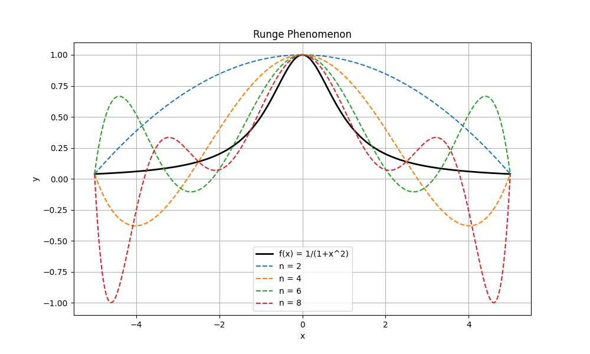
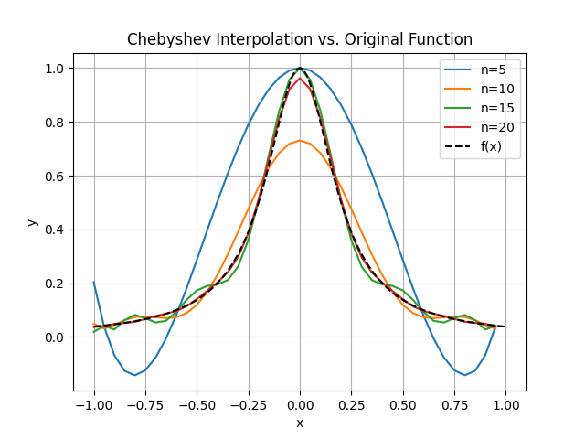

# Programming Homework for Chapter 2

Xiaotong Wang, Oct. 31, 2023.

## Compiliation Guidelines

`Makefile` can help to compile the project. Simply run

```
make
```

in terminal and all executable file will appear in current folder. However, `bash` is required for this tiny script.

You can type

```
make clear
```

to clear files created by the above command.

## Programming report

So simple is the homework that $\LaTeX$ seems not necessary. The report is written below.

Code for problem A is written in `interpolation.h`. In addition to the requirements of the problem, I also write a class `Polynomial`.

For problem B, the figure is shown below: 


For problem C, the figure is shown below:


The output of problem D is:
```
Position at t = 10 seconds: 742.503 feet
Speed at t = 10 seconds: 48.3817 feet/second
The car does not exceed the speed limit of 81 feet/second.
```

The output of problem E is:
```
Predicted weight for Sp1 at 43 days: 14640.3 units
Predicted weight for Sp2 at 43 days: 2981.48 units
Sp1 larvae might survive after 15 more days.
Sp2 larvae might survive after 15 more days.
```