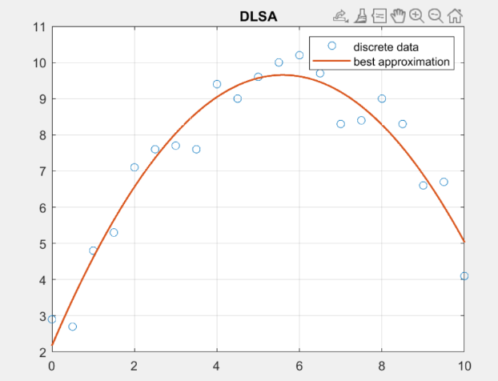

## Problem A

By solving the equation $Ga=c$, we obtain the coefficients $a=(2.17572,2.67041,-0.238444)^{\mathrm{T}}$. Thus the best approximation polynomial is 

$$ \hat{\varphi}(x)=-0.23844x^2+2.67041x+2.17572.$$

## Problem B

Using QR decomposition, we have

$$ A=Q\begin{pmatrix}R\\0\end{pmatrix},\qquad Q^{\mathrm{T}}b=\begin{pmatrix}c\\r\end{pmatrix},$$

which implies $a=R^{-1}c$.

From

$$ G=\begin{pmatrix}21 & 105 & 717\\105 & 717 & 5513 \\ 717 & 5513 & 45167\end{pmatrix},\qquad R=\begin{pmatrix}-4.5826&-22.9129&-156.5713\\&13.8744&138.7444\\&&-37.4438\end{pmatrix},$$

we can calculate that

$$ \mathrm{cond}_G\approx 18091\gg \mathrm{cond}_R \approx 138. $$

## Problem C

*Proof of (a).*

$$ \begin{aligned}(-1)^{j+1}r_j&=\int_0^1\dfrac{(-1)^{j+1}x^j}{1+x}\,\mathrm{d}x\\&=-\int_0^1\dfrac{1}{1+x}+\sum_{i=1}^j(-x)^{i-1}\,\mathrm{d}x\\&=-\ln 2+\sum_{i=1}^j(-1)^{i-1}\dfrac{1}{i}.\end{aligned} $$

Hence $\displaystyle r_j=(-1)^j\ln 2+\sum_{i=1}^j(-1)^{i+j}\dfrac{1}{i}$.

Let $H$ be the Hilbert matrix. From $\alpha=H^{-1}c$, we have $\alpha_j=\beta_j\ln 2+\gamma_j$.

Other results are shown in the program.