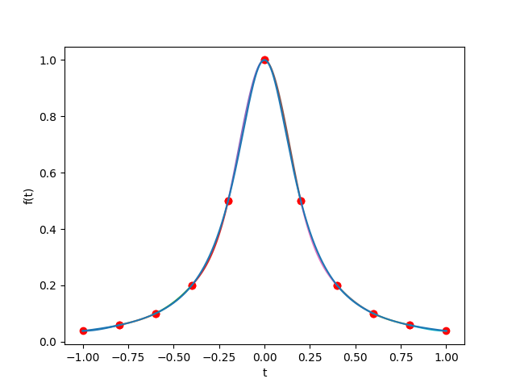

# Document for `XTSpline` library & Examples

By Xiaotong Wang, Jan 2024.

## Table of Contents

- [Document for `XTSpline` library \& Examples](#document-for-xtspline-library--examples)
  - [Table of Contents](#table-of-contents)
  - [Introduction](#introduction)
  - [Usage](#usage)
    - [1. Build](#1-build)
    - [2. Prepare data](#2-prepare-data)
    - [3. Test](#3-test)
    - [4. Visualize](#4-visualize)
  - [Implementation](#implementation)
  - [Examples](#examples)
    - [Problem A.](#problem-a)
    - [Problem B.](#problem-b)
    - [Problem C.](#problem-c)
    - [Problem D.](#problem-d)
    - [Problem E.](#problem-e)

## Introduction

This is a project assignment for the **Numerical Analysis** course at Zhejiang Univ. during the autumn & winter semesters of 2023 ~ 2024. It implements a library for constructing and evaluating splines, with the following features:

- B-spline & PP-spline
- Uniform & non-uniform knot vector
- Curve fitting & function interpolation
- 3 different boundary conditions
- Show accurate coefficients of piecewise polynomials
- Available in both 2D & 3D
- Available on both **Linux & Windows**

## Usage

### 1. Build

The `Makefile` is provided for building the library. Just run the following command:

```bash
make
```

and the object files and executable (for test) will be generated.

### 2. Prepare data

If you wish to fit a curve via the library, prepare a data file in JSON format is all you need to do - coding is not required.

The program reads data from JSON files, with the support of the `nlohmann/json` library. Sample data files are provided in the `input` directory. You can also generate your own data files with the following format:

```json
{
    "splineType": "BSpline", // "BSpline" or "PPSpline"
    "dimension": 2, // 2 or 3
    "points": [ // 2D or 3D points
        [0, 0],
        [1, 1],
        [2, 0]
    ],
    "boundaryCondition": "Natural", // "Natural", "CompleteCubic" or "SecondDerivative"; optional for BSpline
    "boundaryValues": [
        0.0, 
        1.0
    ] // If "boundaryCondition" is "SecondDerivative", this represents the second derivative at boundary points; if "boundaryCondition" is "CompleteCubic", this represents the first derivative at boundary points
}
```

### 3. Test

Once built and having prepared the data file, you can run the test program with the following command:

```bash
./main YOUR_DATA_FILE.json
```

Output will be saved to `polynomials.txt`.

### 4. Visualize

The `plot.py` script is provided for visualizing the result. Make sure you have `polynomials.txt` in the current directory, and run the following command:

```bash
pip install matplotlib # omit if you have installed matplotlib
python3 plot.py
```

## Implementation

The library is implemented in C++11, with the following classes:

- `Function`: a base class for functions, with operator `()` overloaded for evaluation
  - `Polynomial`: a derived class for polynomials, with operator `+`, `-` and `*` overloaded for arithmetic operations; constructor for both coefficients and Newton interpolation points are provided
  - `PiecewisePolynomial`: a derived class for piecewise polynomials
- `Curve`: a base class for curves, with operator `()` overloaded for evaluation
  - `Spline`: a derived class for splines, with a pure virtual function `splineImpl` for implementation
    - `BSpline`: a derived class for B-splines
    - `PPSpline`: a derived class for PP-splines
- `XTReader`: a class for reading data from JSON files using `nlohmann/json`
  
## Examples

The following examples are assignments for the course (see `./problems`).

### Problem A.

Fitting results are shown below (for $N=6, 11, 21, 41, 81$ respectively).





The max-norm of the interpolation error vector at mid-points of the subintervals is calculated as

```
Error for N = 6: 0.422378
Error for N = 11: 0.02052
Error for N = 21: 0.00316891
Error for N = 41: 0.000586206
Error for N = 81: 0.000293076
```

### Problem B.

This is implemented in the library. An example:

```cpp
#include "xtspline.h" 
#include <cmath>

double f (double x) {
    return exp (x) - x * x + 2 * x * x * x;
}
Function func (*f);
BSpline cubicSpline (1, 3, f, -1.0, 1.0, 16);

int main () {
    cubicSpline.print ();
    return 0;
}
```

### Problem C.

See figures below.


### Problem D.

```
Error at -3.5:
Cubic spline: 0.000789971
Quadratic spline: 0.027888
Error at -3:
Cubic spline: 2.22058e-17
Quadratic spline: 0.037931
Error at -0.5:
Cubic spline: 0.0205306
Quadratic spline: 0.0797511
Error at 0:
Cubic spline: -0
Quadratic spline: 0.2
Error at 0.5:
Cubic spline: 0.0205306
Quadratic spline: 0.239278
Error at 3:
Cubic spline: 1.33228e-16
Quadratic spline: 0.0245283
Error at 3.5:
Cubic spline: 0.000789971
Quadratic spline: 0.0185731
```

Cubic spline is more accurate.

### Problem E.

Figures are shown as follows.


